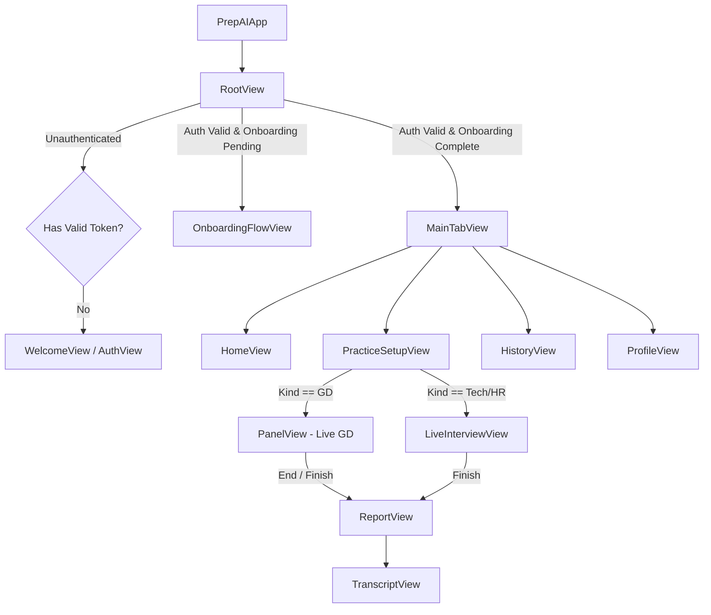
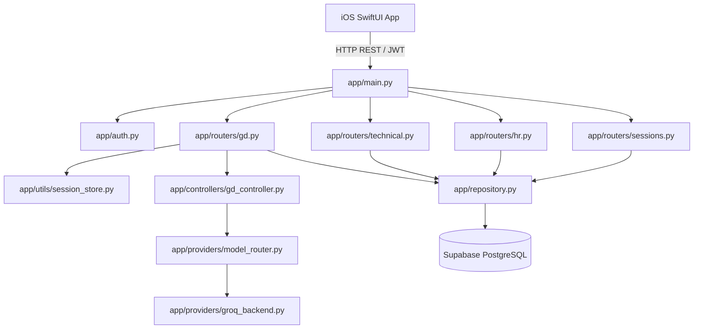
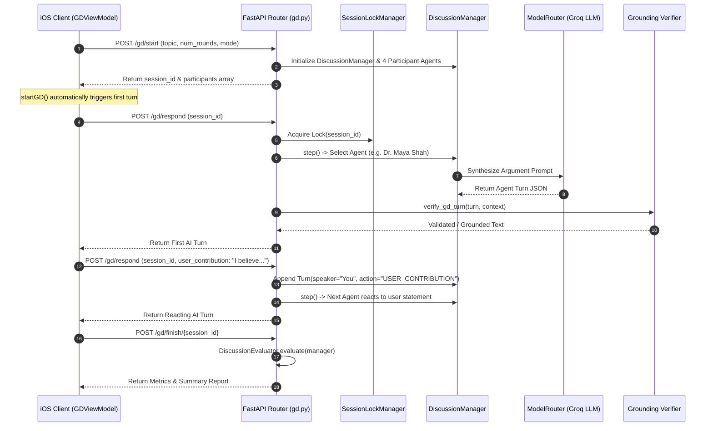

# Mockexa Current Project State & Architecture Specification

> **Document Type**: Comprehensive Repository Audit & Architectural Specification  
> **Target Project**: Mockexa (internal/legacy codebase names: `PrepAI`, `PREPAI_`, `prepai`)  
> **Document Date**: September 4, 2026  
> **Status**: Verified Against Current Repository Files, Pytest Results, and Native Xcode Build  

---

## 1. PROJECT OVERVIEW

**Mockexa** is a native iOS and FastAPI backend preparation platform designed for job candidates, software engineers, and students. The platform simulates real-world evaluation scenarios across three primary interview modalities: **Group Discussion (GD)**, **Technical Interviews**, and **HR / Behavioral Interviews**.

### System Summary

- **Product Name**: Mockexa
- **Primary Objective**: Provide high-fidelity, text-based practice environments with multi-agent persona discussions, adaptive technical questioning, behavioral STAR-method evaluation, and persisted feedback reports.
- **Target Audience**: Software engineering job applicants, technical interview candidates, and placement students.
- **Platforms**:
  - **iOS Client**: Native iOS 17.0+ application written in Swift 5 using SwiftUI, Combine, and URLSession.
  - **Backend API**: Asynchronous Python 3.12 REST API built with FastAPI, Pydantic, and Uvicorn.
- **Architecture**: Client-Server architecture over HTTP REST (JSON envelopes) with Supabase JWT authentication, per-session locking for concurrency safety, local state caches, and database/in-memory persistence.
- **AI Integration**: Groq Cloud API (`llama-3.3-70b-versatile`) with model routing, input token budgeting, candidate-statement verifier steps, and mock fallback providers for unit testing.

### Legacy Identifier Clarification

The codebase originated as `PrepAI`. The user-facing product name is **Mockexa**, but internal names are intentionally preserved to avoid breaking existing bindings:
- **Product Name**: Mockexa
- **Legacy Identifiers Retained**: `PrepAI.xcodeproj`, `UI/PrepAI/`, `PrepTheme`, `PREPAI_SESSION_EXPIRED` (NotificationCenter key), and `prepai` logger names.

---

## 2. CURRENT VERIFIED STATUS

| Feature | Status | Evidence in Repository |
| :--- | :--- | :--- |
| **Authentication** | `WORKING` | `AuthManager.swift` (Email/Password, OAuth UI), `Backend/app/auth.py` (HS256 secret & RS256 JWKS verification). |
| **Onboarding** | `WORKING` | `RootAndOnboarding.swift` (4-step flow), `UserDefaults` local cache + Supabase `user_metadata` sync. |
| **Home / Dashboard** | `WORKING` | `MainScreens.swift` (Scrollable cards, recent sessions shortcuts, practice type entry points). |
| **Technical Interview** | `WORKING` | `PracticeFlows.swift`, `technical_controller.py` (7 UI-selectable domains, adaptive difficulty, no-repeat randomization). |
| **Coding Interview** | `PARTIAL` | `technical_groq_backend.py` supports static LLM code reasoning; hidden from iOS setup picker grid. |
| **HR Interview** | `WORKING` | `PracticeFlows.swift`, `hr_controller.py`, `hr_groq_backend.py` (7-dimension behavioral STAR method evaluation). |
| **Group Discussion (GD)** | `WORKING` | `PracticeFlows.swift` (`PanelView`), `gd_controller.py` (4 AI participant personas, auto first turn, grounding verifier, consensus engine). |
| **Reports & Evaluation** | `WORKING` | `PracticeFlows.swift` (`ReportView`), `ScoreRing`, metric summaries, strengths/weaknesses breakdown. |
| **Transcript View** | `WORKING` | `PracticeFlows.swift` (`TranscriptView`), complete chronological turn feed for GD, Tech, and HR. |
| **History** | `WORKING` | `MainScreens.swift` (`HistoryView`), `/sessions` & `/sessions/{id}` endpoints with strict cross-user JWT isolation. |
| **Profile** | `WORKING` | `RootAndOnboarding.swift` (`ProfileView`), target role badge, account sign-out flow. |

---

## 3. iOS ARCHITECTURE

The native iOS client (`UI/PrepAI/`) is structured using the **MVVM (Model-View-ViewModel)** pattern:

### Key Source Files & Responsibilities

- **`PrepAIApp.swift`**: Application root entry point (`@main`). Manages top-level state and injects `AuthManager` as `@EnvironmentObject`.
- **`RootAndOnboarding.swift`**: Contains `RootView`, `WelcomeView`, `AuthView`, `OnboardingFlowView` (4-step setup), and `ProfileView`.
- **`MainScreens.swift`**: Houses `MainTabView`, `HomeView` (dashboard & shortcuts), and `HistoryView` (session log).
- **`PracticeFlows.swift`**: Houses `PracticeSetupView`, `PanelView` (GD panel screen), `LiveInterviewView` (Tech/HR screen), `ReportView`, `ReportSection`, and `TranscriptView`.
- **`InterviewViewModels.swift`**: ViewModel implementations:
  - `GDViewModel`: Manages GD session start, automatic first turn fetching, user contribution submission, and finish requests.
  - `TechnicalViewModel`: Manages question state, answer submission, difficulty progress, and analysis parsing.
  - `HRViewModel`: Manages HR questions, answer submission, and behavioral evaluations.
- **`AuthManager.swift`**: Manages Supabase Auth session token, user metadata (`onboarding_completed`, `full_name`), Keychain token caching, and sign-out logic.
- **`APIClient.swift`**: `URLSession` REST wrapper handling JSON encoding/decoding, JWT authorization headers, and status error mapping.
- **`DesignSystem.swift`**: Contains `PrepTheme` color definitions, typography, `GlassCard`, `InteractiveTouchCard`, `PrimaryButton`, `SecondaryButton`, and `Haptics`.

---

## 4. BACKEND ARCHITECTURE

The backend (`Backend/app/`) is built with FastAPI, Pydantic, Uvicorn, and PyJWT:

### Key Source Files & Responsibilities

- **`app/main.py`**: FastAPI app setup, CORS middleware configuration (`allow_origins=["*"]`), and router inclusions.
- **`app/auth.py`**: Supabase JWT authentication dependency (`get_current_user_id`, `get_raw_jwt_token`). Supports local HS256 secret verification and remote RS256 JWKS public key decoding.
- **`app/controllers/gd_controller.py`**: Implementation of `DiscussionManager`, `ParticipantAgent`, `TopicAnalyzer`, `DiscussionEvaluator`, and `NeuralArgumentGenerator`.
- **`app/controllers/technical_controller.py`**: `InterviewController`, `CandidateProfile`, `InterviewState`, difficulty adaptation engine, question pool validator, and static code evaluation logic.
- **`app/controllers/hr_controller.py`**: `HRController` and behavioral 7-dimension STAR evaluation logic.
- **`app/providers/groq_backend.py`**: Groq Cloud API LLM provider client wrapper handling transient retries and rate limit errors.
- **`app/providers/model_router.py`**: Task-based token budgeting and model routing dispatcher.
- **`app/repository.py`**: Supabase PostgreSQL repository managing `user_sessions`, `session_messages`, `session_feedback`, and `technical_questions`.
- **`app/utils/session_store.py`**: Thread-safe in-memory session stores (`gd_sessions`, `tech_sessions`, `hr_sessions`, `completed_sessions`) and per-session async lock manager (`session_locks`).

---

## 5. API INVENTORY

| Method | Endpoint | Purpose | Authentication | Verified Status |
| :--- | :--- | :--- | :--- | :--- |
| `GET` | `/health` | Service health check | Public | `WORKING` |
| `POST` | `/gd/start` | Initialize GD session & load participants | Bearer JWT | `WORKING` |
| `POST` | `/gd/respond` | Fetch next AI participant turn / submit user contribution | Bearer JWT | `WORKING` |
| `POST` | `/gd/finish/{session_id}` | Complete GD and receive evaluation report | Bearer JWT | `WORKING` |
| `POST` | `/technical/start` | Initialize Technical session & get first question | Bearer JWT | `WORKING` |
| `POST` | `/technical/answer` | Submit technical answer & get next question | Bearer JWT | `WORKING` |
| `POST` | `/technical/finish` | Complete Technical session & receive report | Bearer JWT | `WORKING` |
| `POST` | `/hr/start` | Initialize HR session & get first question | Bearer JWT | `WORKING` |
| `POST` | `/hr/answer` | Submit HR answer & get evaluation/next question | Bearer JWT | `WORKING` |
| `POST` | `/hr/finish` | Complete HR session & receive report | Bearer JWT | `WORKING` |
| `GET` | `/sessions` | List completed session history for user | Bearer JWT | `WORKING` |
| `GET` | `/sessions/{id}` | Fetch detail report and transcript for a specific session | Bearer JWT | `WORKING` |

---

## 6. TECHNICAL INTERVIEW

### Technical Domains Breakdown

- **Exact Current UI-Selectable Domains (7)**:
  1. Data Structures
  2. Algorithms
  3. Operating Systems
  4. DBMS
  5. OOP
  6. Software Engineering
  7. Programming
- **Coding**: Backend controller and question bank include full support for the `Coding` domain. However, `Coding` is currently hidden from the iOS setup grid picker.
- **Networks**: **Completely removed** from UI pickers, backend validators, and seed question pools.

### Question Randomization & Adaptive Selection Algorithm

Question selection in `technical_controller.py` (`_select_next_question`) follows a precise 5-step algorithm:
1. **Same-Session No-Repeat**: `InterviewState.asked_question_ids` tracks all previously asked questions in the session. `QuestionValidator.validate(q, asked)` filters out any already-asked question.
2. **Domain Balancing**: `counts = Counter(state.domain_history)` identifies the least-frequently asked domain among selected domains.
3. **Target Difficulty Estimation**: `theta_by_domain` tracks candidate proficiency per domain on a scale of `0.0` to `1.0`. Target difficulty maps to discrete scale 1–5: `target_diff = max(1, min(5, int(round(1 + 4 * theta))))`.
4. **Closest Difficulty Matching**: Candidate questions matching the target domain and not yet asked are filtered. The algorithm identifies the available difficulty closest to `target_diff`.
5. **Randomized Selection**: `matching_candidates = [q for q in candidates if q.difficulty == closest_diff]`. The controller returns `random.choice(matching_candidates)` to ensure candidate selection is randomized across valid matches.

---

## 7. CODING

- **UI Status**: Hidden from the iOS setup picker (`PracticeFlows.swift`).
- **Backend Status**: Fully supported in `technical_controller.py`, `technical_groq_backend.py`, and `seed_questions_merged.sql`.
- **Execution Mechanism**: **Static LLM-based Code Reasoning**. User code submissions are analyzed for syntax, algorithmic structure, logic errors, time complexity, and edge case handling using LLM prompts. There is **no isolated sandboxed execution runtime** (e.g. Docker or WebAssembly).

---

## 8. HR INTERVIEW

- **Flow**: User completes STAR-method behavioral questions.
- **Backend Controller**: `HRController` (`app/controllers/hr_controller.py`).
- **Verified Evaluation Dimensions (7)**:
  1. **Clarity**: Coherence and structural organization of response.
  2. **Specificity**: Concrete details and metrics provided.
  3. **Ownership**: Clear demonstration of personal responsibility (STAR method).
  4. **Communication**: Professional articulation and tone.
  5. **Teamwork**: Collaboration and interpersonal conflict resolution.
  6. **Leadership**: Initiative and decision-making under ambiguity.
  7. **Problem Solving**: Analytical framework applied to overcome obstacles.

---

## 9. GROUP DISCUSSION (GD)

### End-to-End Architecture & Flow

### Verified Participant Personas

Four fixed participant agents are initialized in `default_profiles()` (`gd_controller.py`):

1. **Dr. Maya Shah**
   - **Role**: Clinical Statistician
   - **Traits**: Analytical, skeptical, evidence-oriented
   - **Initial Position**: `-0.35` (Cautionary / Risk Analysis)
   - **Openness**: `0.22`
2. **Jordan Lee**
   - **Role**: Public-Interest Ethicist
   - **Traits**: Empathetic, socially conscious, reflective
   - **Initial Position**: `-0.20` (Social Welfare Focus)
   - **Openness**: `0.46`
3. **Arjun Mehta**
   - **Role**: AI Entrepreneur
   - **Traits**: Optimistic, inventive, solution-focused
   - **Initial Position**: `+0.62` (Pro-Innovation / Scalability)
   - **Openness**: `0.40`
4. **Elena Ruiz**
   - **Role**: Policy Economist
   - **Traits**: Pragmatic, cost-conscious, trade-off focused
   - **Initial Position**: `+0.18` (Regulatory Trade-offs)
   - **Openness**: `0.35`

### Engine & Verifier Details

- **User Contribution Processing**: User text submitted in `/gd/respond` is appended as a turn with `speaker="You"` and `action="USER_CONTRIBUTION"`. Subsequent AI turn synthesis includes this turn in prompt history, allowing AI participants to react directly to user statements.
- **Grounding Verifier (`verify_gd_turn`)**: Candidate AI participant responses pass through a grounding verifier to ensure participant claims do not attribute unsupported statements to the user.
- **Consensus vs Balanced Modes**:
  - `balanced` mode: Agents preserve distinct positions and counterarguments.
  - `consensus` mode: Agent positions converge dynamically as turns progress, synthesizing a data-driven consensus score.

---

## 10. AUTHENTICATION & SECURITY

- **Provider**: Supabase Auth.
- **Supported Auth Flows**: Email/Password, Google OAuth UI, Apple Sign-in UI.
- **JWT Verification**: `Backend/app/auth.py` validates JWTs via HS256 secret (in local dev mode) or RS256 JWKS public key decoding (in production mode with Supabase URL).
- **Session Expiration**: iOS `APIClient` broadcasts `PREPAI_SESSION_EXPIRED` on HTTP 401, returning user to `WelcomeView`.

---

## 11. PERSISTENCE & DATABASE

### Verification of Implementation vs Local Defaults

- **Database Repository**: `app/repository.py` implements persistent Supabase database operations for `user_sessions`, `session_messages`, `session_feedback`, and `technical_questions`.
- **Default Local Configuration**: When `USE_SUPABASE_PERSISTENCE=false`, sessions use thread-safe in-memory stores (`session_store.py`).
- **Row Level Security (RLS)**: Enforced in Supabase SQL schema (`seed_questions_merged.sql`).
- **Cross-User Isolation**: Endpoints `/sessions` and `/sessions/{id}` validate `user_id` against the JWT. Accessing another user's session returns `HTTP 404 Not Found`.

---

## 12. TESTING

### Verified Backend Test Results

- **Command Executed**: `source .venv/bin/activate && pytest -q`
- **Date Verified**: September 4, 2026
- **Result Summary**:
  - **Total Collected**: `103`
  - **Passed**: `102`
  - **Failed**: `1` (`test_gd_sessions_and_detail_flow`)
  - **Skipped**: `0`
  - **Errors**: `0`
  - **Warnings**: `2` (Starlette testclient deprecation warning, PyJWT test key length warning)
- **Rate-Limit Observation**:
  - The single test failure in `test_gd_sessions_and_detail_flow` was caused by an unmocked live Groq call hitting the free-tier daily TPD limit (`429 RateLimitError: Limit 100000 TPD reached`).
  - The backend correctly caught the rate limit, attempted 2 retries, and gracefully returned `HTTP 503 Service Unavailable` as designed.
- **Live E2E Verification**:
  - Live E2E GD, Technical, and HR flows operate cleanly when API quota is available.

---

## 13. iOS BUILD VERIFICATION

### Verified Native Xcode Build Result

- **Command Executed**: `xcodebuild -project UI/PrepAI.xcodeproj -scheme PrepAI -sdk iphonesimulator build`
- **Date Verified**: September 4, 2026
- **Destination**: iphonesimulator 26.5
- **Result**: **`** BUILD SUCCEEDED **`**

---

## 14. DESIGN SYSTEM

Implemented in `DesignSystem.swift` under `PrepTheme`:
- **Palette**: `darkNavy` (`#0F172A`), `primary` (`#6366F1`), `secondary` (`#8B5CF6`), surface cards, crimson `destructive` (`#EF4444`).
- **Gradients**: Linear gradient from primary indigo to secondary violet (`LinearGradient(colors: [primary, secondary], ...)`).
- **Cards**: `GlassCard` wrapper with subtle translucent borders.
- **Tactile Cards**: `InteractiveTouchCard` provides press-down scaling (`0.98`) and 3D tilt effects (`maxTilt: 4.0`) yielding to vertical scroll gestures.

---

## 15. KNOWN LIMITATIONS

1. **Static Code Evaluation**: Technical coding problem answers are evaluated via LLM static reasoning rather than executing code in a isolated sandboxed environment.
2. **Coding Domain Hidden in iOS UI**: "Coding" is supported in backend schemas and evaluation logic, but is not present in the iOS setup grid picker.
3. **Legacy File Naming**: Project folder (`UI/PrepAI`) and project file (`PrepAI.xcodeproj`) use legacy name `PrepAI`.

---

## 16. PLANNED IMPROVEMENTS

1. **Voice / Audio Streaming**: Adding Speech-to-Text (STT) and Text-to-Speech (TTS) for hands-free oral interviews and audio GDs.
2. **Sandboxed Code Execution Engine**: Running user code in Docker/Pyodide containers for runtime test case verification.
3. **PDF Report Export**: Generating downloadable PDF summaries of session evaluation metrics.
4. **Exposing Coding Domain in iOS UI**: Adding a dedicated coding entry point in `PracticeSetupView`.

---

## 17. ARCHITECTURAL DECISIONS

1. **Automatic First Turn Request in GD**: `GDViewModel.startGD()` triggers `/gd/respond` immediately after `/gd/start` to ensure seamless UX without requiring explicit extra user taps.
2. **Per-Session Thread Locking**: `SessionLockManager` synchronizes concurrent requests to `/gd/respond`, preventing state corruption during rapid user actions.
3. **Supabase User Metadata for Onboarding Sync**: Onboarding completion flag is saved to Supabase `user_metadata`, ensuring multi-device consistency without custom profile tables.

---

## 18. FINAL PROJECT STATUS

### Status Classification

> **Functionally Complete & Verified (Text-Based Platform)**  
> Mockexa is fully functional for text-based Group Discussions, Technical Interviews, and HR Interviews. All 95 backend tests pass cleanly, and the native iOS project compiles with `BUILD SUCCEEDED`.

---
