# Mockexa — Complete Project Overview & Technical Architecture

> **Document Type**: Comprehensive System Inspection, Architecture Blueprint & Feature Matrix  
> **Target Project**: Mockexa
> **Status**: Verified Against Full Codebase, Pytest (150/150 Passed), and Native Xcode Build (`BUILD SUCCEEDED`)
> **Last Inspected**: October 1, 2026

---

## 1. Executive Summary

**Mockexa** is a production-grade, AI-powered placement and interview readiness platform built for software engineering candidates, college students, and tech professionals. It integrates a native **iOS 17+ SwiftUI** client with an asynchronous **Python 3.12 / FastAPI** backend powered by Google's Gemini models, Supabase Authentication, and high-fidelity neural audio synthesis.

The platform provides a realistic, multimodal practice environment spanning:
1. **Adaptive Technical & System Design Interviews** (7 engineering domains + coding reasoning).
2. **Behavioral HR Interviews** (STAR-method prompts with 7-dimension scoring).
3. **Multi-Agent Group Discussion (GD) Simulations** (4 distinct AI persona agents with real-time turn taking and grounding verification).
4. **Company-Specific Question Banks & Target Drills** (Google, Microsoft, Amazon, etc. with category filtering and instant review).
5. **Friends Group Discussion & Multiplayer Lobby** (Room creation, matchmaking queue, live status polling, and gamified reward wallet).
6. **AI Resume Builder & ATS Score Analyzer** (Real-time ATS parsing, AI bullet point enhancer, and native PDF/DOCX multi-template export).
7. **Full-Duplex Voice Engine** (Native iOS Speech-to-Text with silence detection, local Apple System TTS, and neural ElevenLabs/OpenAI TTS streaming with LRU audio caching).

---

## 2. Verified Repository Health & Build Status

| Component | Target Runtime / Framework | Verification Command | Verified Status |
| :--- | :--- | :--- | :--- |
| **Backend Test Suite** | Python 3.12 / Pytest / FastAPI | `source .venv/bin/activate && pytest` | **150 Passed, 0 Failed** |
| **iOS Native Build** | Swift 5 / iOS 17.0+ / Xcode | `xcodebuild -project UI/Mockexa.xcodeproj -scheme Mockexa -destination 'generic/platform=iOS Simulator' clean build` | **`** BUILD SUCCEEDED **`** |
| **LLM Provider** | Google Gemini Cloud API | `gemini_backend.py`, `model_router.py` | Operational with automatic retry and fallback routing |
| **Authentication** | Supabase REST + JWT | `auth.py`, `AuthManager.swift` | Operational (HS256 local / RS256 JWKS remote) |

---

## 3. High-Level Architecture Diagram

```mermaid
graph TB
    subgraph Client ["iOS Native Client (SwiftUI / Combine / iOS 17+)"]
        UI_Main["App Entry & Tab Bar<br/>(MockexaApp / MainScreens)"]
        UI_Tech["Technical & HR Practice<br/>(PracticeFlows / InterviewViewModels)"]
        UI_GD["AI Panel & Friends GD<br/>(PanelView / FriendsGD)"]
        UI_Company["Company Question Bank<br/>(CompanyQuestionBank)"]
        UI_Resume["AI Resume & ATS Builder<br/>(ResumeViews / ResumeViewModel)"]
        VoiceEngine["Voice Foundation & Audio<br/>(AVAudioEngine / SFSpeechRecognizer)"]
        ExportEngine["Document Exporters<br/>(PDFExportService / DOCXExportService)"]
        AuthMgr["AuthManager<br/>(Keychain / Supabase OAuth & PKCE)"]
    end

    subgraph API ["FastAPI Backend (Python 3.12 / Uvicorn)"]
        Router_Health["/health"]
        Router_Tech["/technical (Start, Answer, Finish)"]
        Router_HR["/hr (Start, Answer, Finish)"]
        Router_GD["/gd (Start, Respond, Finish, Friends Lobby)"]
        Router_Company["/company (Companies, Questions, Practice)"]
        Router_TTS["/tts (ElevenLabs / OpenAI Neural Streaming)"]
        Router_Sessions["/sessions (History & Transcripts)"]
        AuthMiddleware["JWT Middleware<br/>(HS256 Secret / RS256 JWKS)"]
        SessionLocks["SessionLockManager<br/>(Per-Session Concurrency Guards)"]
    end

    subgraph AI_Data ["AI Engine & Storage"]
        GeminiClient["Gemini Backend<br/>(gemini-3.8-flash)"]
        TTSProviders["ElevenLabs / OpenAI TTS APIs"]
        SupabaseStore["Supabase PostgreSQL / Local In-Memory Store"]
    end

    UI_Main --> AuthMgr
    UI_Tech --> Router_Tech
    UI_Tech --> Router_HR
    UI_GD --> Router_GD
    UI_Company --> Router_Company
    UI_Resume --> ExportEngine
    VoiceEngine --> Router_TTS
    
    API --> AuthMiddleware
    Router_GD --> SessionLocks
    Router_Tech --> GeminiClient
    Router_HR --> GeminiClient
    Router_GD --> GeminiClient
    Router_TTS --> TTSProviders
    Router_Sessions --> SupabaseStore
```



---

## 4. Key Functional Modules & Implementation Details

### 4.1. Technical Interview System
- **Source Files**: 
  - Backend: [`Backend/app/routers/technical.py`](Backend/app/routers/technical.py), [`Backend/app/controllers/technical_controller.py`](Backend/app/controllers/technical_controller.py), [`Backend/app/controllers/technical_gemini_backend.py`](Backend/app/controllers/technical_gemini_backend.py)
  - iOS: [`UI/Mockexa/PracticeFlows.swift`](UI/Mockexa/PracticeFlows.swift), [`UI/Mockexa/InterviewViewModels.swift`](UI/Mockexa/InterviewViewModels.swift)
- **7 Selectable Core Domains**:
  1. Data Structures
  2. Algorithms
  3. Operating Systems
  4. DBMS
  5. Object-Oriented Programming (OOP)
  6. Software Engineering
  7. Programming Languages
- **Adaptive Question Selection Algorithm**:
  1. *Same-Session No-Repeat*: Tracks `asked_question_ids` to guarantee unique questions.
  2. *Domain Balancing*: Tracks domain frequency history with `Counter` to evenly distribute questions across chosen areas.
  3. *Proficiency Tracking*: Continuous candidate theta estimation ($\theta \in [0.0, 1.0]$) dynamically adapts target difficulty (scale 1–5).
  4. *Distance Minimization*: Selects from candidate pool matching closest difficulty to target theta.
  5. *Uniform Randomization*: Randomly samples from matching pool.
- **Evaluation Criteria**: Correctness, Completeness, Relevance, Reasoning, and Missing Concepts detection via Gemini LLM.

### 4.2. Behavioral HR Interview System
- **Source Files**:
  - Backend: [`Backend/app/routers/hr.py`](Backend/app/routers/hr.py), [`Backend/app/controllers/hr_controller.py`](Backend/app/controllers/hr_controller.py), [`Backend/app/controllers/hr_gemini_backend.py`](Backend/app/controllers/hr_gemini_backend.py)
  - iOS: [`UI/Mockexa/PracticeFlows.swift`](UI/Mockexa/PracticeFlows.swift), [`UI/Mockexa/InterviewViewModels.swift`](UI/Mockexa/InterviewViewModels.swift)
- **Framework**: Guided STAR (Situation, Task, Action, Result) methodology.
- **7 Evaluation Dimensions**:
  1. **Clarity**: Structural coherence and conciseness.
  2. **Specificity**: Concreteness, data points, and quantifiable outcomes.
  3. **Ownership**: Explicit first-person accountability vs. passive team attribution.
  4. **Communication**: Professional tone, poise, and vocabulary.
  5. **Teamwork**: Conflict resolution, empathy, and cross-functional collaboration.
  6. **Leadership**: Initiative, vision, and navigating ambiguity.
  7. **Problem Solving**: Methodological troubleshooting and analytical approach.

### 4.3. Multi-Agent Group Discussion (GD) Engine
- **Source Files**:
  - Backend: [`Backend/app/routers/gd.py`](Backend/app/routers/gd.py), [`Backend/app/controllers/gd_controller.py`](Backend/app/controllers/gd_controller.py)
  - iOS: [`UI/Mockexa/PracticeFlows.swift`](UI/Mockexa/PracticeFlows.swift) (`PanelView`), [`UI/Mockexa/InterviewViewModels.swift`](UI/Mockexa/InterviewViewModels.swift)
- **AI Participant Personas**:
  - **Dr. Maya Shah**: Clinical Statistician (analytical, cautious, data/evidence-driven).
  - **Jordan Lee**: Public-Interest Ethicist (empathetic, human-centric, societal impact focus).
  - **Arjun Mehta**: AI Entrepreneur (optimistic, disruptive, scalability-focused).
  - **Elena Ruiz**: Policy Economist (pragmatic, regulatory tradeoffs, cost-benefit analyst).
- **Core Architecture**:
  - *Automatic Kickoff*: `startGD()` automatically triggers turn 1 to provide zero-wait immersion.
  - *Grounding Verifier*: `verify_gd_turn` prevents hallucinated attribution to candidate arguments.
  - *Modes*: `balanced` (agents preserve counterarguments) vs. `consensus` (positions dynamically converge).
  - *Per-Session Concurrency Lock*: `SessionLockManager` synchronizes rapid turn submissions.

### 4.4. Friends Group Discussion & Social Multiplayer
- **Source Files**:
  - Backend: [`Backend/app/controllers/gd_friends.py`](Backend/app/controllers/gd_friends.py)
  - iOS: [`UI/Mockexa/FriendsGD.swift`](UI/Mockexa/FriendsGD.swift)
- **Multiplayer Features**:
  - Room Management: Create private rooms with custom topics, or join via 6-character room codes.
  - Matchmaking Queue: Automated matchmaking pool pairing candidates by topic and duration.
  - Ready State Machine: Synchronized participant lobby with toggleable ready statuses and host start control.
- **Reward Wallet & Gamification**:
  - Currency system: Experience Points (XP) and Coins.
  - Level progression: 250 XP per tier.
  - Boost Inventory: `2x XP Boost`, `2x Coin Boost`, and `Power Boost` (stackable multiplier).
  - Granular event logging preventing duplicate rewards.

### 4.5. Company-Specific Question Bank
- **Source Files**:
  - Backend: [`Backend/app/routers/company.py`](Backend/app/routers/company.py), [`Backend/app/controllers/company_controller.py`](Backend/app/controllers/company_controller.py), [`Backend/app/data/company_questions.py`](Backend/app/data/company_questions.py)
  - iOS: [`UI/Mockexa/CompanyQuestionBank.swift`](UI/Mockexa/CompanyQuestionBank.swift)
- **Features**:
  - Comprehensive question catalogs categorized by employer (Google, Amazon, Microsoft, Meta, etc.).
  - Filters by category (`DSA`, `Technical`, `System Design`, `Behavioral`) and job role.
  - Dual evaluation modes: High-speed heuristic evaluation or deep Gemini LLM scoring.
  - Interactive drill practice with review solutions, focus points, and completion analytics.

### 4.6. AI Resume Builder & ATS Score Analyzer
- **Source Files**:
  - iOS: [`UI/Mockexa/ResumeModels.swift`](UI/Mockexa/ResumeModels.swift), [`UI/Mockexa/ResumeService.swift`](UI/Mockexa/ResumeService.swift), [`UI/Mockexa/ResumeViewModel.swift`](UI/Mockexa/ResumeViewModel.swift), [`UI/Mockexa/ResumeViews.swift`](UI/Mockexa/ResumeViews.swift)
  - Exporters: [`UI/Mockexa/PDFExportService.swift`](UI/Mockexa/PDFExportService.swift), [`UI/Mockexa/DOCXExportService.swift`](UI/Mockexa/DOCXExportService.swift)
- **Capabilities**:
  - **ATS Compatibility Scoring**: Real-time evaluation calculating section completeness, bullet action verb strength, quantification percentage, and structural readability.
  - **AI Bullet Enhancer**: Refactors weak resume bullets into high-impact statements using active verbs and metric placeholders, explaining *why* the revision is stronger.
  - **Document Generation**:
    - **PDF Engine**: Native CoreGraphics / PDFKit generation supporting 4 templates (*ATS Safe Standard*, *Modern Professional*, *Compact Student*, and *Custom Extracted*).
    - **DOCX Engine**: Native XML package builder exporting fully styled, editable `.docx` Word documents directly on-device.

### 4.7. Full-Duplex Voice Engine & Neural TTS
- **Source Files**:
  - Backend: [`Backend/app/routers/tts.py`](Backend/app/routers/tts.py)
  - iOS: [`UI/Mockexa/VoiceFoundation.swift`](UI/Mockexa/VoiceFoundation.swift)
- **Features**:
  - **Speech-to-Text (STT)**: Apple `SFSpeechRecognizer` with real-time audio power metering, voice activity detection, and automatic silence commit.
  - **Dual TTS System**:
    1. *Local System TTS*: Zero-latency `AVSpeechSynthesizer` with persona-specific voice pitch and speech rates.
    2. *Neural Streaming TTS*: Backend `/tts` endpoint delivering high-fidelity audio via ElevenLabs (with custom persona parameters) or OpenAI (`tts-1`).
  - **Optimizations**:
    - Automatic markdown and bullet point sanitization prior to speech synthesis.
    - LRU audio cache in backend memory avoiding redundant synthesis charges and network delays.

### 4.8. Content Moderation & Language Validation
- **Source File**: [`UI/Mockexa/LanguageValidator.swift`](UI/Mockexa/LanguageValidator.swift)
- **Validation Pipeline**:
  - Devanagari script detection to reject non-Latin Hindi text in professional GD practice.
  - Transliterated Hinglish keyword scoring with ratio thresholds.
  - Apple `NaturalLanguage` framework checks to ensure spoken responses adhere to English language requirements.

---

## 5. Security & Authentication Architecture

- **Authentication Providers**: Supabase Auth REST API.
  - Email & Password with secure session tokens.
  - Google OAuth with PKCE using `ASWebAuthenticationSession` (`mockexa://auth/callback`).
  - Apple Sign-In native authorization using `ASAuthorizationAppleIDProvider`.
- **Token Storage**: Encrypted iOS Keychain via `MOCKEXA_ACTIVE_SESSION`.
- **Backend Verification**: Dual JWT verification (`Backend/app/auth.py`):
  - Local mode: Fast HMAC SHA-256 (`HS256`) secret verification.
  - Production mode: Asymmetric RSA (`RS256`) public key decoding via Supabase JWKS endpoints.
- **Cross-User Isolation**: All session history and transcript endpoints (`/sessions/{id}`) enforce strict user ownership checks against JWT claims.

---

## 6. Project Structure Overview

```
Mockexa/
├── Backend/
│   ├── app/
│   │   ├── controllers/
│   │   │   ├── company_controller.py      # Company practice & evaluation engine
│   │   │   ├── gd_controller.py           # Multi-agent GD simulation & persona agents
│   │   │   ├── gd_friends.py              # Multiplayer lobbies, matchmaking & rewards
│   │   │   ├── hr_controller.py           # Behavioral STAR assessment logic
│   │   │   ├── hr_gemini_backend.py       # Gemini prompt runner for HR evaluations
│   │   │   ├── technical_controller.py    # Adaptive difficulty & pool selection
│   │   │   └── technical_gemini_backend.py# Gemini prompt runner for technical evaluation
│   │   ├── data/
│   │   │   └── company_questions.py       # Curated question banks for top firms
│   │   ├── providers/
│   │   │   ├── gemini_backend.py          # Gemini API client with retries & backoff
│   │   │   ├── llm_backend.py             # LLM provider protocol abstraction
│   │   │   └── model_router.py            # Task-specific token budgeting and dispatch
│   │   ├── routers/
│   │   │   ├── company.py                 # Company question catalog & practice routes
│   │   │   ├── gd.py                      # GD session initialization & turns
│   │   │   ├── health.py                  # Service health monitoring
│   │   │   ├── hr.py                      # Behavioral interview routes
│   │   │   ├── sessions.py                # User session history & report storage
│   │   │   ├── technical.py               # Technical interview routes
│   │   │   └── tts.py                     # Neural ElevenLabs/OpenAI TTS endpoint
│   │   ├── schemas/                       # Pydantic request/response schemas
│   │   ├── utils/
│   │   │   ├── session_store.py           # Thread-safe in-memory session caches & locks
│   │   │   └── token_budget.py            # Token budget estimators
│   │   ├── auth.py                        # Supabase JWT verification dependency
│   │   ├── config.py                      # Application environment settings
│   │   ├── main.py                        # FastAPI application entry point
│   │   └── repository.py                  # Supabase database operations layer
│   ├── tests/                             # Pytest test suite (150 tests)
│   ├── requirements.txt                   # Backend dependencies
│   └── seed_questions_merged.sql          # Question bank database seeds
│
├── UI/
│   └── Mockexa/
│       ├── MockexaApp.swift                # Native iOS @main entry point
│       ├── RootAndOnboarding.swift        # Welcome, Auth & Onboarding wizards
│       ├── MainScreens.swift              # MainTabView, Dashboard & History views
│       ├── PracticeFlows.swift            # Technical, HR & GD practice screens
│       ├── CompanyQuestionBank.swift      # Company question explorer & drills
│       ├── FriendsGD.swift                # Multiplayer GD rooms, lobby & wallet UI
│       ├── ResumeViews.swift              # Resume builder, editor & preview views
│       ├── ResumeViewModel.swift          # Resume reactive state & ATS score engine
│       ├── ResumeService.swift            # AI resume improvement service
│       ├── ResumeModels.swift             # Structured resume data structures
│       ├── PDFExportService.swift         # CoreGraphics PDF rendering (4 templates)
│       ├── DOCXExportService.swift        # Word (.docx) document generator
│       ├── VoiceFoundation.swift          # Speech-to-Text & Text-to-Speech manager
│       ├── LanguageValidator.swift        # Real-time Hinglish/Devanagari moderator
│       ├── InterviewViewModels.swift      # GD, Tech & HR reactive view models
│       ├── AuthManager.swift              # Supabase Auth & Keychain session manager
│       ├── APIClient.swift                # URLSession HTTP REST client
│       ├── APISchemas.swift               # Swift Decodable/Encodable DTOs
│       ├── DesignSystem.swift             # MockexaTheme palette, GlassCard & 3D tilt
│       └── Config.swift                   # Client runtime configurations
│
├── MOCKEXA_CURRENT_PROJECT.md             # Detailed engineering audit log
├── PROJECT_OVERVIEW.md                    # Current comprehensive project documentation
└── README.md                              # Public presentation & setup guide
```

---

## 7. Running & Testing the Project

### Running Backend
```bash
cd Backend
source .venv/bin/activate
uvicorn app.main:app --host 0.0.0.0 --port 8000 --reload
```

### Running Backend Tests
```bash
cd Backend
source .venv/bin/activate
pytest -v
```

### Building iOS Project
```bash
cd UI
xcodebuild -project Mockexa.xcodeproj -scheme Mockexa -destination 'generic/platform=iOS Simulator' clean build CODE_SIGNING_ALLOWED=NO
```

---

## 8. Summary of Architectural Strengths

1. **Deterministic Fallbacks**: Every AI-driven feature (company practice, resume improvement, GD turns) includes resilient local heuristic fallback paths to guarantee zero downtime during network or quota constraints.
2. **True Multimodality**: Combines tactile interactive touch gestures, real-time audio wave analysis, neural voice synthesis, and dynamic code/text editors.
3. **Strict Security Posture**: Token isolation, row-level security (RLS), and per-session thread locking prevent race conditions and cross-tenant data leakage.
4. **Clean Codebase**: 100% test pass rate across 150 backend integration/unit tests and clean native Swift compilation on iOS 17+.
